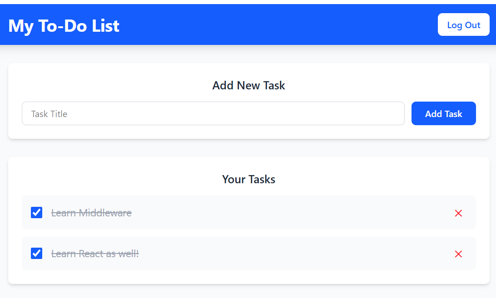
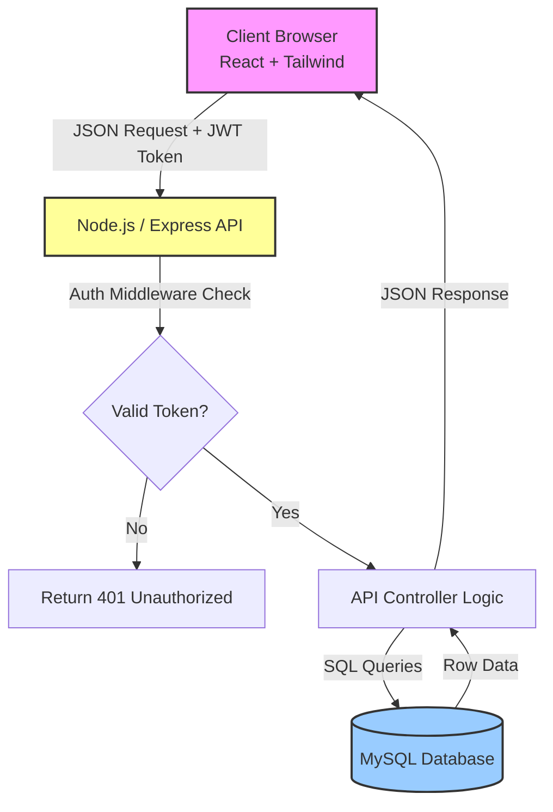
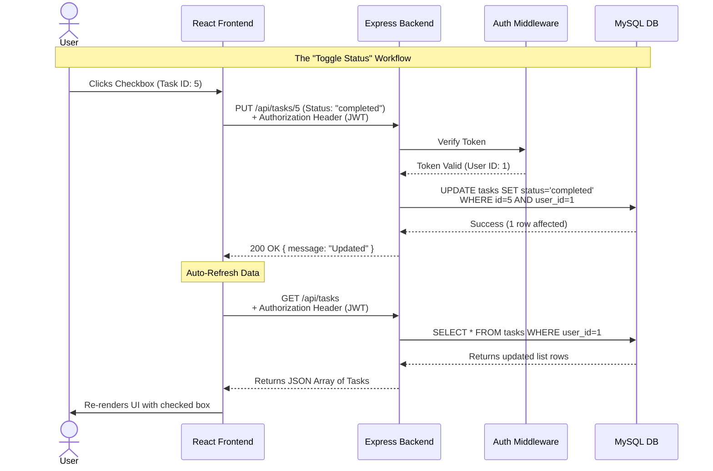

# To-Do List SaaS Application

A professional, secure, multi-user task management SaaS application built with a modern REST API architecture. Manage your productivity with ease through a clean interface and robust security.

---

## 🚀 Features

-   **User Authentication**: Secure registration and login using stateless JWT and bcrypt password hashing.
-   **Protected Routes**: Dashboard and task management accessible only to authenticated users.
-   **Task Management**: Create, view, update, and delete tasks with immediate database persistence.
-   **Status Tracking**: Toggle task status between Pending and Completed with real-time UI updates.
-   **User Privacy**: Strict authorization logic ensuring users only interact with their own data.
-   **Responsive Design**: Styled with Tailwind CSS for a seamless experience across devices.

---

## 🏗️ Architecture

### System Overview

### Data Workflow

---

## 🛠️ Tech Stack

### Frontend

### Backend

### Database

---

## ⚙️ Getting Started

### Prerequisites

-   Node.js (v16+)
-   MySQL Server
-   npm or yarn

### 1. Clone the Repository

\`\`\`bash
git clone https://github.com/your-username/todo-saas-app.git
cd todo-saas-app
\`\`\`

### 2. Database Setup

1. Log in to your MySQL terminal:
   \`\`\`sql
   CREATE DATABASE todo_db;
   \`\`\`
2. The application includes an initialization script to create the necessary tables (\`users\`, \`tasks\`).
3. You will run this script after configuring the backend environment variables.

### 3. Backend Configuration

1. Navigate to the backend directory:
   \`\`\`bash
   cd todo-backend
   npm install
   \`\`\`
2. Create a \`.env\` file:
   \`\`\`env
   PORT=3000
   DB_HOST=localhost
   DB_USER=your_mysql_user
   DB_PASSWORD=your_mysql_password
   DB_NAME=todo_db
   JWT_SECRET=your_super_secret_key
   \`\`\`
3. Initialize the database schema:
   \`\`\`bash
   node models/init.js
   \`\`\`
4. Start the backend server:
   \`\`\`bash
   npm run dev
   \`\`\`

### 4. Frontend Configuration

1. Open a new terminal and navigate to the frontend directory:
   \`\`\`bash
   cd todo-frontend
   npm install
   \`\`\`
2. Create a \`.env\` file:
   \`\`\`env
   VITE_API_URL=http://localhost:3000/api
   \`\`\`
3. Start the frontend development server:
   \`\`\`bash
   npm run dev
   \`\`\`

---

## 🔒 Security

-   **Authentication**: Stateless sessions via JWT stored in \`localStorage\`.
-   **Authorization**: Custom middleware verifies ownership of resources before any DB operation.
-   **Data Integrity**: Passwords are never stored in plain text, using \`bcrypt\` for hashing.
